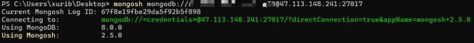

# MongoDB教程

版本：1.0.0     

更新时间：2025-04-11

作者：旭日彬彬

学习难度：简单

## 基础篇

### 简介

MongoDB 是一个开源的 **NoSQL 文档数据库**。它属于非关系型数据库中的文档存储类型，使用类似 JSON 的 BSON 格式存储数据。数据以 **文档(Document)** 形式存储，而文档组织在 **集合(Collection)** 中，而集合组织在 **数据库(Database)** 中。

### 基本概念

在学习这个数据库之前，我们先了解一下他的基本概念：**数据库**，**集合**，**文档**。

**数据库**：是用于存放**集合**（Collection）的**容器**。请把他简单的看作一个容器，没有其他的概念，就是一个容器。MongoDB中可以创建多个数据库。

**集合**：用于存放**文档**（Document）的**容器**。没错，也请把他简单的看作一个容器。

**文档**：MongoDB数据库存储数据的最小组织单元，是一个类JSON结构的文档，我们把他称为BSON。对JSON结构不了解的读者可参考链接：[https://www.runoob.com/json/json-tutorial.html](https://www.runoob.com/json/json-tutorial.html)

### 连接数据库

连接数据库的工具有很多，我们采用官方的**Mongo Shell**作为演示，他是一个命令行程序。官网下载链接：[https://www.mongodb.com/try/download/shell](https://www.mongodb.com/try/download/shell)

安装过程一路点Next，傻瓜式安装即可。

安装完成后，**mongosh**命令会自动注册到电脑中。终端中输入下面的命令查看版本，判断软件是否安装成功。*找不到命令可尝试重启电脑*。

```powershell
mongosh --version
```

下面开始连接MongoDB，连接语法如下

```powershell
mongosh mongodb://[username:password@]hostname:port[/database]
```

示例图片如下： 

### 数据库操作

<mark>前提已连接到MongoDB数据库，这里不在演示</mark>

常用命令如下：

```powershell
db                       //查看当前所在数据库
show dbs                 //查看所有不为空的数据库，空的数据库不会显示
use database             //切换到指定数据库，不存在则创建
db.dropDatabase()        //删除当前所在的数据库
```

综合示例如下：


### 集合操作

<mark>前提已连接到MongoDB数据库，这里不在演示</mark>

常用命令如下：

```powershell
db.createCollection("name")    //创建集合
db.collection.drop()           //删除集合
show collections               //查看当前数据库所有集合
show tables                    //查看当前数据库所有集合
```
